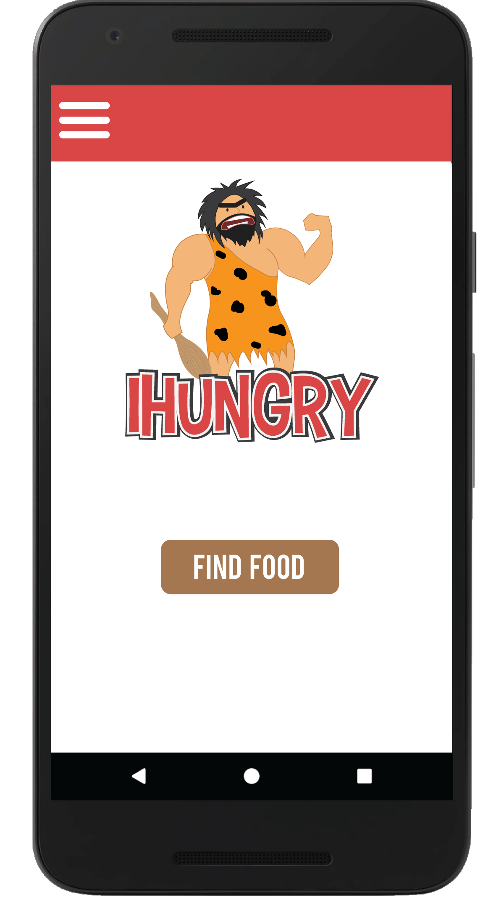
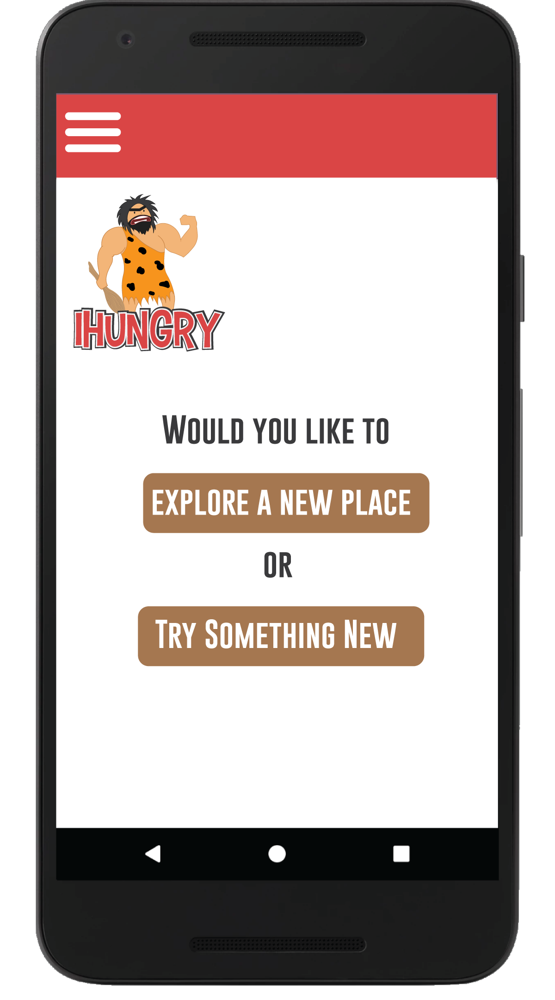
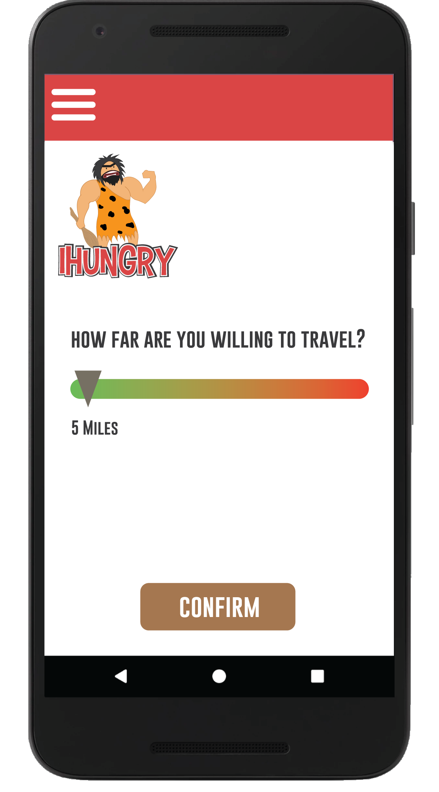
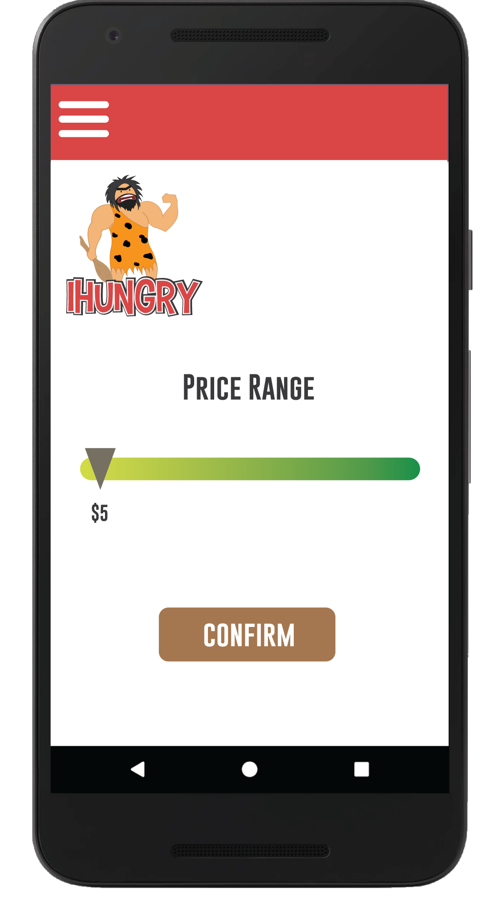
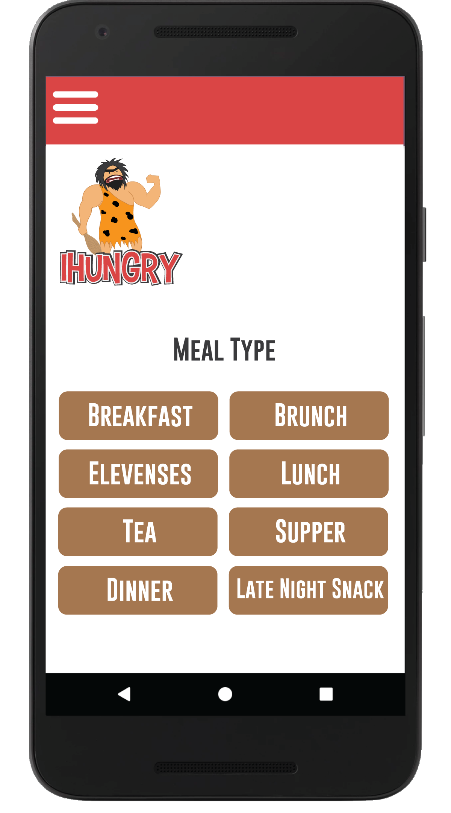
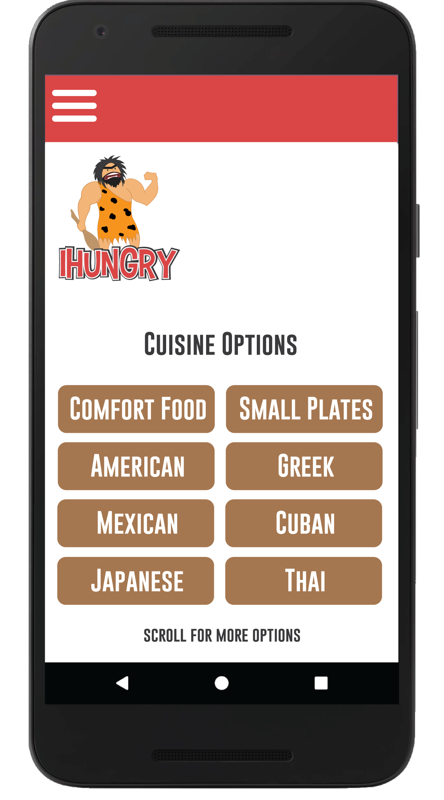
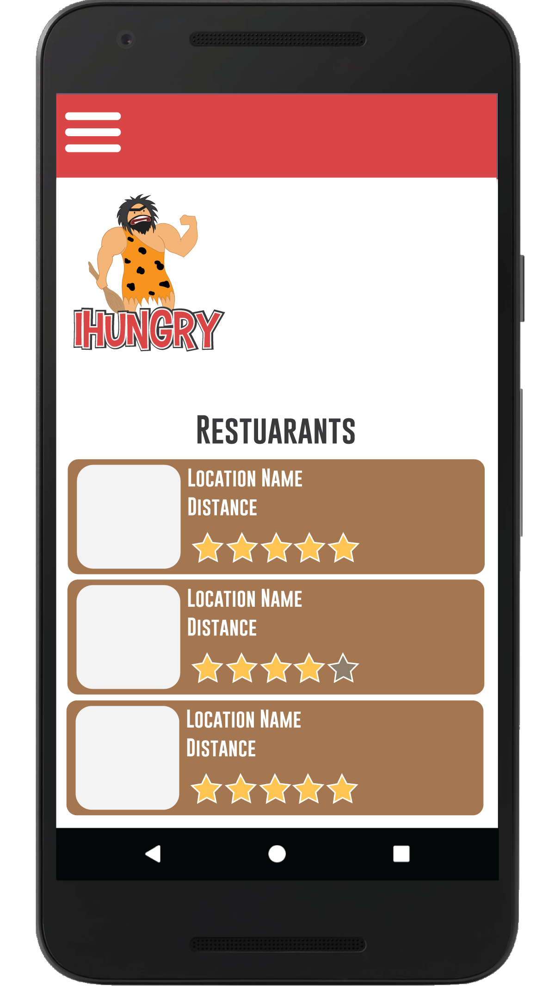
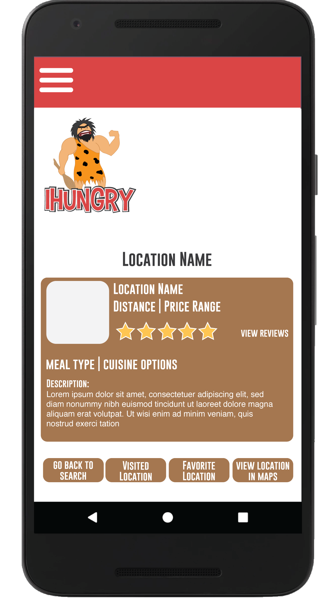

# iHungry

IHungry developed as a project for my Mobile Applications Development course at Miami Dade College.

## Description

### What problem is your application solving? What needs is your application fulfilling?

Your long-awaited lunch time is about to begin in five minutes, you are tired of the same ol’ tuna sandwich, and your co-workers have encouraged you to try out a new restaurant. But where can that be? What location is capable of satisfying your sudden craving for a traditional greek gyro? And will this location lie within the proximity of your job in order to make it back on time? Instead of spending those precious five minutes searching the internet endlessly, you can simply find your answer on iHungry. iHungry is an Android application with the purpose to help its users find a location to eat within their preferred area of distance, cuisine category, meal type, and even price with a click of a few buttons. 

### How does it work?
The main screen will prompt the user for the distance they are willing to travel. After inputting their information, the app will proceed to ask the user if they wish to try something new or pick a location in their ‘Favorite Locations’ list. The screen will then prompt the user to select what meal type they are interested in such as breakfast, lunch, or dinner. After making the selection, they will be asked for their cuisine preference such as comfort food, small plates, cuban, etc. Finally, the app will prompt the user for a price range. After answering all of the questions, a list of locations will populate the screen for the user to pick from. If they are indecisive, they can select the ‘Pick for Me’ button which will randomly select a location from the given list. Once a location is selected, the user can view details about the location such as the name, recent reviews, and buttons to either call the restaurant or open the map for directions. 

### Intended Users
Millennials

## Features

Data Persistence / Intents / Location-Awareness / Fragments

- [ ] User selects preferences in different areas: 
- [ ] Option: Try new location or location from favorites
- [ ] Option: Distance willing to travel
- [ ] Option: Price Range
- [ ] Option: Meal Type
- [ ] Option: Cuisine Category
- [ ] User can store locations in their favorites
- [ ] User can store locations visited to optimize experience
- [ ] User can review locations
- [ ] User can upload pictures within their reviews
- [ ] User can click a button to send intent to Google Maps
- [ ] User can click a button to send intent to make a phone call to location

### Non-Functional Requirements
- [ ] Security
- [ ] Scalability

## Wireframe
  

  

  
